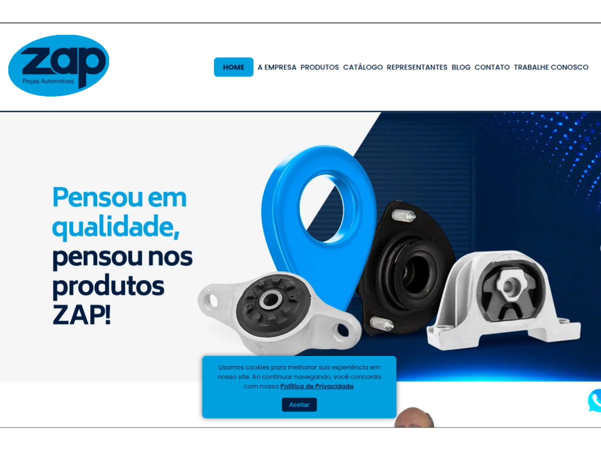

# ZAP Peças - WordPress Theme

ZAP Peças is a custom WordPress theme tailored for auto parts companies. Built with performance, modularity, and SEO in mind, it provides a robust foundation for cataloging products, showcasing company information, and enhancing customer interaction.



## 🚀 Features

- ⚙️ **Custom Post Types** for Products
- 🧩 **Modular Theme Structure** using `get_template_part()` for easy scalability
- 🔍 **Custom Taxonomies** for filtering by product line and manufacturer
- 💡 **SEO Friendly** structure with semantic HTML and schema.org microdata
- 📱 **Responsive Design** optimized for mobile and desktop
- 🧭 **Breadcrumbs and Search Integration**
- 📂 Archive and single templates for products (`archive.php`, `single-produto.php`)
- 🔄 GitHub deployment via CI/CD (`.github/workflows/deploy.yml`)

## 🗂️ Project Structure

```
zappecas-main/
├── assets/css/components/       # Component-specific CSS
├── partials/                    # Reusable template parts
├── inc/                         # Helper functions and hooks
├── functions.php                # Theme setup and includes
├── style.css                    # Theme metadata and global styles
├── front-page.php               # Homepage structure
├── archive.php                  # Archive template
├── single-produto.php           # Single product page
├── taxonomy-linha.php           # Custom taxonomy template
├── .github/workflows/           # GitHub Actions for deployment
```

## 🧰 Technologies Used

- **WordPress** (Classic Theme)
- **PHP**
- **HTML5 / CSS3**
- **ACF (Advanced Custom Fields)**
- **Schema.org**
- **Git + GitHub Actions**

## 📸 Screenshots

> _You can add images or animations here. Send me the files or links and I’ll integrate them._  
> Example:
> 

## ⚙️ Installation

1. Download or clone this repository
   ```bash
   git clone git@github.com:rodrigophpweb/zappecas.git
   ```
2. Copy the theme folder into your WordPress `wp-content/themes/` directory
3. Activate the theme from the WordPress admin panel
4. Import or configure ACF fields as needed (JSON settings available in `acf-json/`)

## 📦 Deployment

This theme includes a GitHub Actions workflow to automate deployment. You can customize the `.github/workflows/deploy.yml` file to match your hosting environment.

## 👨‍💻 Author

**Rodrigo Vieira Eufrásio da Silva**  
[GitHub @rodrigophpweb](https://github.com/rodrigophpweb)

---

Feel free to contribute, fork, or open issues for enhancements and feedback.
